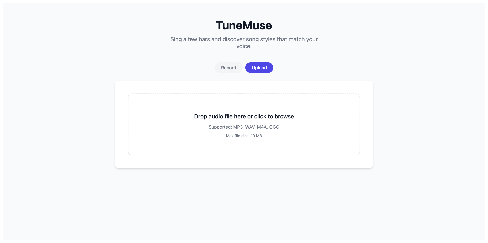

# TuneMuse 🎵

> 💡 **Note**: This project is implemented using the [spec-kit](https://github.com/github/spec-kit) standard process. For comparison, you can check out [tune-muse-assgin](https://github.com/xymelon/tune-muse-assgin), which is implemented using spec-kit extension feature.



TuneMuse is an AI-powered music recommendation application that analyzes your vocal profile and suggests songs tailored to your unique voice. By extracting audio features and analyzing dimensions like pitch, rhythm, mood, timbre, and expression, TuneMuse provides personalized song directions and matching confidences.

## 🌟 Features

- **Vocal Profile Analysis**: Analyzes user's voice across 5 key dimensions: Pitch, Rhythm, Mood, Timbre, and Expression.
- **AI Song Recommendation**: Uses a hybrid rule engine and LLM (Anthropic Claude) refinement to recommend suitable song genres and specific reference songs.
- **Audio Recording & Uploading**: Built-in browser audio recorder and file upload interface.
- **Signal Quality Checking**: Automatically evaluates audio quality (volume, noise, pitch variation, vocal presence) before processing.
- **Progress Tracking**: Compare different analysis sessions side-by-side to track your vocal development over time.

## 🏗️ Architecture

The project follows a modern client-server architecture:

### Frontend
- **Framework**: React 19 + TypeScript + Vite
- **Routing**: React Router
- **Audio Processing**: `meyda` for feature extraction and `pitchfinder` for pitch detection.

### Backend
- **Framework**: FastAPI (Python 3.11+)
- **Testing**: `pytest` for unit, integration, and contract testing.
- **AI/LLM**: Integrates with Claude for enhanced and refined song recommendations.

## 🚀 Getting Started

### Prerequisites

- Node.js (v18+)
- Python (3.11+)

### Backend Setup

1. Navigate to the `backend` directory:
   ```bash
   cd backend
   ```
2. Create and activate a virtual environment:
   ```bash
   python -m venv .venv
   source .venv/bin/activate  # On Windows use: .venv\Scripts\activate
   ```
3. Install dependencies:
   ```bash
   pip install -r requirements.txt
   ```
4. Configure environment variables:
   ```bash
   cp app/.env.example app/.env
   ```
   Edit `app/.env` and fill in the required values:
   | Variable | Description |
   |---|---|
   | `ANTHROPIC_API_KEY` | Your Anthropic API key for Claude-powered recommendations |
   | `DATABASE_URL` | Database connection string (default: `sqlite:///./tunemuse.db`) |
   | `CORS_ORIGINS` | Allowed frontend origin (default: `http://localhost:5173`) |
   | `SECRET_KEY` | Application secret key (must change in production) |

5. Start the FastAPI development server:
   ```bash
   uvicorn app.main:app --reload --port 8000
   ```

### Frontend Setup

1. Navigate to the `frontend` directory:
   ```bash
   cd frontend
   ```
2. Install dependencies:
   ```bash
   npm install
   ```
3. Start the Vite development server:
   ```bash
   npm run dev -- --host 0.0.0.0
   ```

The frontend will be available at `http://localhost:5173` and the backend API documentation at `http://localhost:8000/docs`.

## 🧪 Testing

The backend includes comprehensive testing (Unit, Integration, and Contract tests).
To run the test suite:
```bash
cd backend
pytest
```

## 📄 License

This project is licensed under the MIT License.
